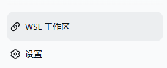

# dsh-wsl-workspace

一个独立的 DeepSeek Harness 树外 bundle。在 Web 工作区侧边栏提供手动 WSL 开关、发行版选择和 Linux 目录浏览，将选中的 WSL 目录直接添加为 DSH 工作区；进入 WSL 工作区后，Agent 的 `bash` 会自动在对应的 Ubuntu/WSL 目录执行命令。

An independent out-of-tree bundle for DeepSeek Harness. It adds a manual WSL switch, distribution picker, and Linux directory browser to the Web workspace sidebar, then opens the selected WSL directory as a DSH workspace. Agents in that workspace automatically run `bash` commands inside the selected Ubuntu/WSL directory.



## 功能 / Features

- 开关默认关闭；只有用户手动启用后才访问 WSL。
- 自动发现当前 Windows 用户安装的 WSL 发行版。
- 支持浏览目录或输入 `/home/user/project` 这类绝对 Linux 路径。
- 使用 Host 返回的 `\\wsl.localhost\<distribution>\...` 路径创建标准 DSH 工作区。
- Host、Web Client、Typert Remote 和 bundle patch 全部包含在一个 npm 包中。
- WSL 工作区 Agent 的 `bash` 自动使用 `wsl.exe` 进入当前发行版和 Linux 工作目录；普通 Windows 工作区不受影响。
- 不依赖 DSH 的 Win32 PTY 检测；命令桥接直接使用 `wsl.exe`。
- 不需要在 WSL 内安装 VS Code Server；只需发行版中已有 `bash`，项目工具（例如 Rust/Node/Python）按需安装。
- 不修改 DSH 的 `packages/bundle/web-app`、根 tsconfig 或其他随发行文件。

- The switch defaults to off and WSL is accessed only after explicit opt-in.
- Installed WSL distributions are discovered automatically.
- Browse directories or enter an absolute Linux path such as `/home/user/project`.
- The Host returns an authoritative `\\wsl.localhost\<distribution>\...` path for the standard DSH workspace service.
- Host, Web Client, Typert Remote, and bundle patch ship in one npm package.
- Agents in a WSL workspace automatically run `bash` commands with `wsl.exe` in the selected distribution and Linux cwd; normal Windows workspaces are unchanged.
- It does not depend on DSH's Win32 PTY inspection; command routing uses `wsl.exe` directly.
- No VS Code Server is required inside WSL. The distro only needs `bash`; project toolchains such as Rust, Node.js, or Python are installed as needed.
- No DSH distribution file needs to be edited.

## 本地安装 / Local installation

先构建插件：

```powershell
pnpm --dir D:\Desktop\dsh-plugins\wsl-workspace install
pnpm --dir D:\Desktop\dsh-plugins\wsl-workspace build
```

然后通过 Web profile 一句话安装并挂载：

```powershell
pnpm --dir D:\Desktop\deepseek-harness dsh plugin --profile web add link:D:/Desktop/dsh-plugins/wsl-workspace
```

发布版可直接从 GitHub 一句话安装（需要 DSH 源码已安装）：

```powershell
pnpm --dir D:\Desktop\deepseek-harness dsh plugin --profile web add github:wepar1212/dsh-wsl-workspace
```

仓库已包含预构建的 `lib/`，安装者无需先下载插件源码或单独构建。

重启 DSH 后，在侧边栏底部点击 WSL 按钮，手动打开开关，选择发行版和目录。

Build the plugin first, then install the local link with the profile command above. Restart DSH and use the WSL action at the bottom of the sidebar.

For the published build, install it in one line from GitHub:

```powershell
pnpm --dir D:\Desktop\deepseek-harness dsh plugin --profile web add github:wepar1212/dsh-wsl-workspace
```

The repository includes the prebuilt `lib/` output, so users do not need a separate source checkout or build step.

## 卸载 / Uninstall

```powershell
pnpm --dir D:\Desktop\deepseek-harness dsh plugin --profile web remove dsh-wsl-workspace
```

## 开发 / Development

```powershell
pnpm build
pnpm test
pnpm typecheck
```

## 终端权限 / Terminal permissions

启用 WSL 工作区后，Agent 的命令在 WSL Linux 环境中运行。Windows 沙箱不能继续限制已经进入 Linux 的命令，因此这些命令按用户明确选择的 WSL 工作区使用完整 WSL 权限。请只对可信项目启用此功能。

After a WSL workspace is enabled, its Agent commands run inside the selected WSL Linux environment. The Windows sandbox cannot confine commands after they cross into Linux, so these commands use the full WSL permissions explicitly granted by choosing the WSL workspace. Enable it only for trusted projects.

## 限制 / Limitations

- 仅支持运行在 Windows Host 上且可调用 `wsl.exe` 的 DSH。
- WSL 命令需要 Windows Host、可用的 `wsl.exe`、目标发行版和 `bash`；每次命令都是独立调用，不保留 shell 环境变量或交互状态。
- 只选择目录，不创建、重命名、移动或删除 WSL 文件。
- 每次更新源码后需要重新执行 `pnpm build` 并重启 DSH。

- Requires a Windows Host with `wsl.exe` available.
- WSL commands require a Windows Host, `wsl.exe`, the selected distribution, and `bash`; each call is isolated and does not retain interactive shell state or exported variables.
- Directory selection only; no create, rename, move, or delete operations.
- Rebuild and restart DSH after source updates.
